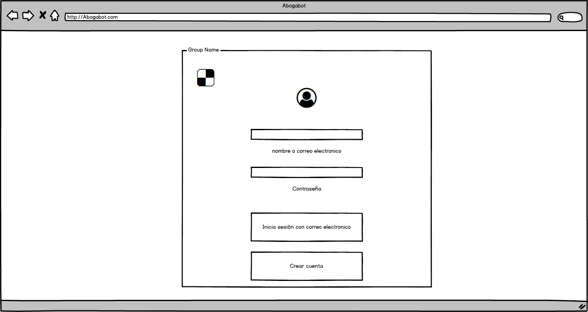
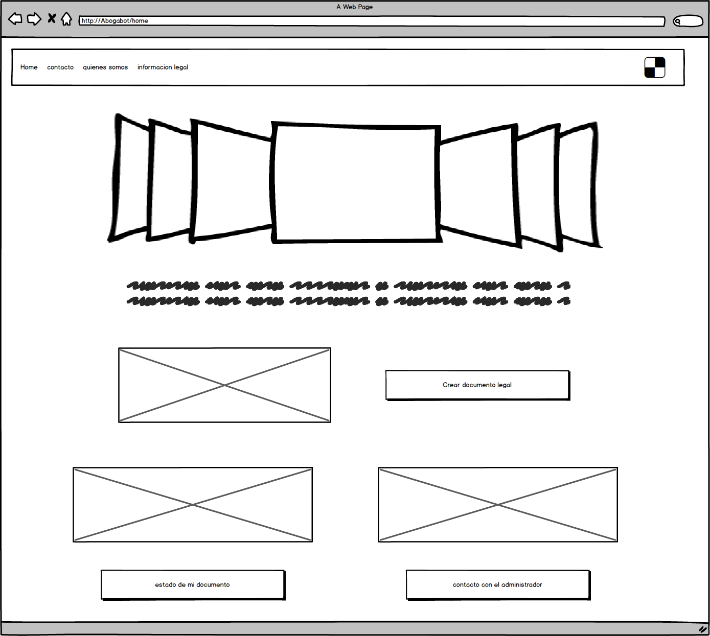
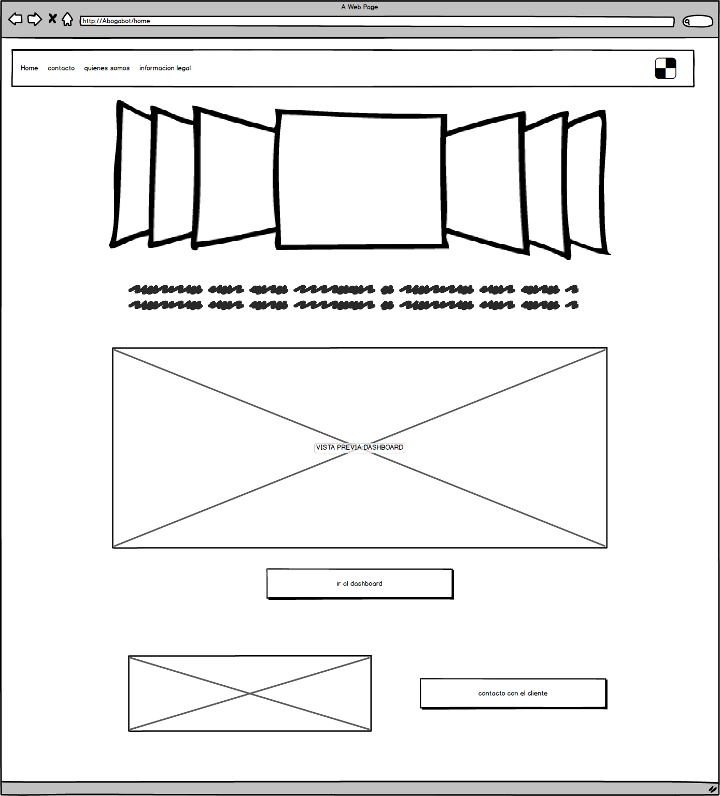

## Práctica de Wireframe

Para esta práctica me apoye de la siguiente herramienta:
- Balsamic mockups (https://balsamiq.com/wireframes/)

 ### Checa estas Mock ups !!! :camera:

### Inicio de sesión

El usuario puede ingresar con una cuenta creada al momento o bien vincular su cuenta con su correo electrónico de gmail.

### Sesión de cualquier usuario

El usuario entra y puede ver un slide de noticias o comunicados importantes mientras que solo tiene tres opciones:

- Crear un documento legal
- Estado de los documentos
- contacto con el administrador

### Sesión del adiminstrador

El administrador tendra acceso inmediato a una vista precvia del Dashboard con el cual puede monitorizar todos los documentos legales en proceso ademas, puede "ir al dashboard" para tener más detalles. Tiene la posibilidad de mandar correo a alguno de los clientes en caso de requerirlo de forma rápida.

:rocket: