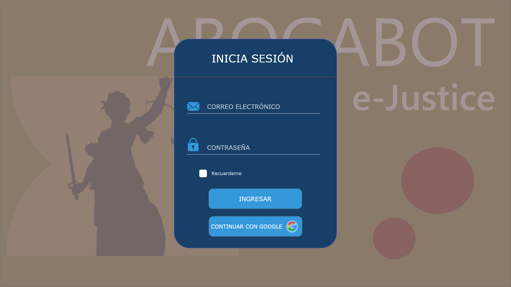
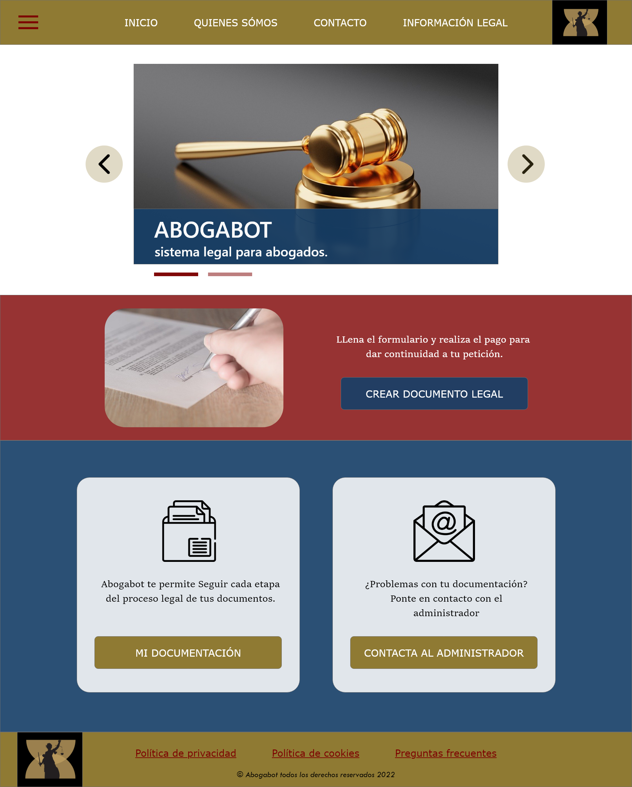

## Práctica de UI (user interface)

Para esta práctica me apoye de la siguiente herramienta:
- Balsamic mockups (https://www.adobe.com/mx/products/xd.html)

:alien: :alien: :alien:

### Inicio de sesión

### Sesión iniciada

### Sesión iniciada como administrador
